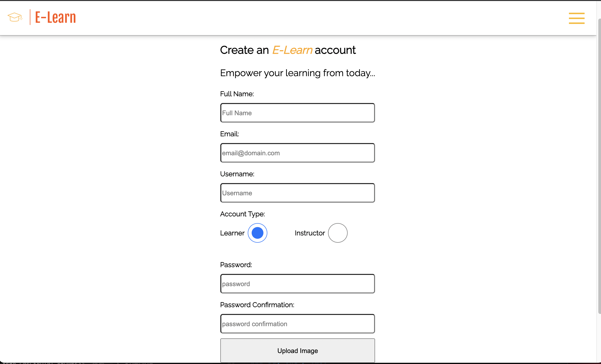
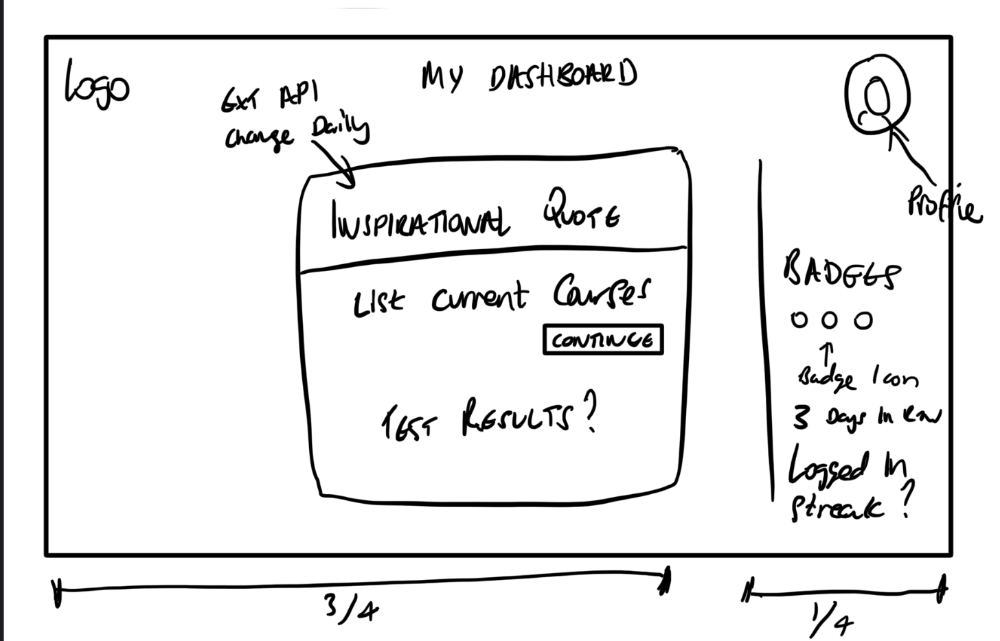
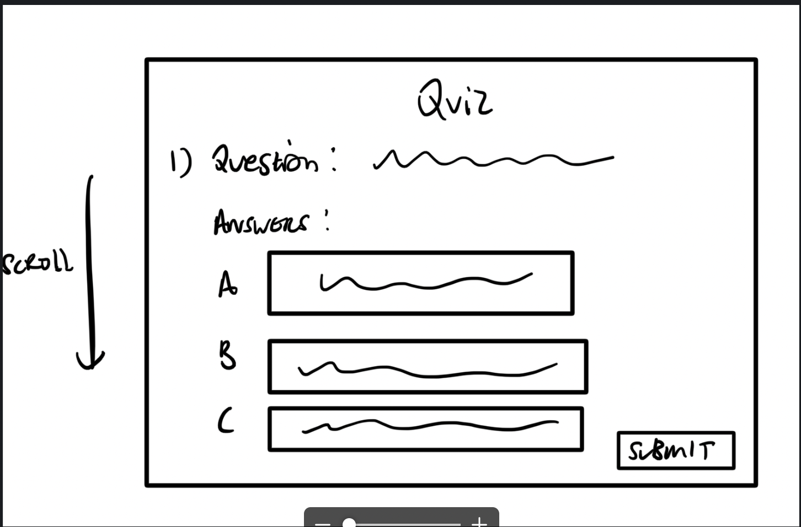
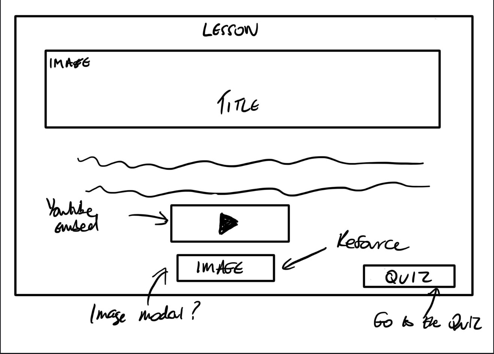
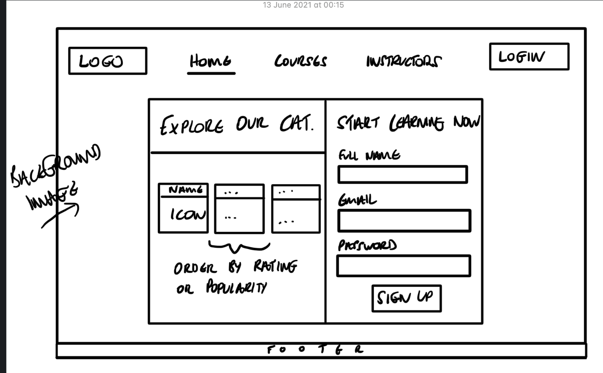
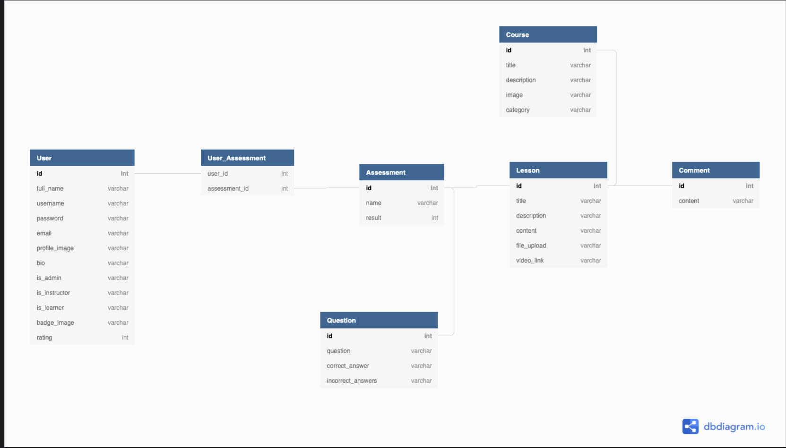

# Project 4: E-Learn - created using Django & React
## Timeframe : *10 Days*
### Goal: 

Build an application using Django, PostgresSQL, React full-stack application

## Technologies Applied:

- HTML5
- CSS3
- React
- Git
- GitHub
- Google Fonts
- Animate.css library

## Overview:
This was my final project at General Assembly, given 10 days to build a full stack website using Django, PostgreSQL and React. As a pair we decided to go for a E-Learn application aimed at anyone who wants to learn in subject areas Computing, English, Science and Maths. The website allows a user to register as an Instructor or Learner. The Instructor can post courses, lessons, assessments




link to front-end [click here](https://github.com/rizwanakhtar7/project-4-client/tree/main)


### Controls
- At the Home page you can Login as an existing user or navigate to Register as an Instructor or Learner. 

- Once logged in you can navigate to the courses main page to view all courses, or filter by a given subject such as Maths. The user can then click on courses to view all the lessons in a course and then individual lessons details page which will contain a video of the lesson, quiz to test your knowledge and content of the lesson. You can also post a comment where an Instructor can respond to  questions / feedback you have.

### Day One / Two:
* Pseudocoding and Sign off with steps ERD Diagram and mockups:
- Create Navbar Component which has links to home page and other components on the app 









### Day Three / Four:
- we focused on the Models in Django. We numerous models in our app and alot of relations between the different tables. Namely Courses - Lessons - Assessments - Questions - Answers

I was also involved in implementing the rating field to give learners the ability to give a rating after watching a course and then the average would be shown on the courses index for users. To implement this feature we had to have many to many relations for the rating by, favorited by and foreign key for the users for one to many relationship accordingly. All of this on the course table :

```
 rating_by = models.ManyToManyField(
        'jwt_auth.User',
        related_name='ratings',
        blank=True
    )
    favorited_by = models.ManyToManyField(
        'jwt_auth.User',
        related_name='favorites',
        blank=True
    )
    owner = models.ForeignKey(
        'jwt_auth.User',
        related_name="courses_created",
        on_delete=models.CASCADE
    )

```

### Day Five:

After we had the models completed we implemented the controllers, endpoints. I spent time testing the endpoints for courses,lessons and detail pages for these. Also testing the rated by fields to show an average stars


### Day six / seven:

We moved onto front end creating the sidenavbar. I firstly built the course index with the filter functionality to filter by a certain subject.
I then spent time rendering the lessons index and lessons detail with the content, assessment and comments accordingly.
I also spent time finding and adding quotes for the Dashboard for learners and Instrucors

### Wins
- The biggest win was definately becoming comfortable with Django and how to migrate and create models, controllers and test endpoints. Our project was complicated in terms of the models  so we had to often go back to the backend at some point to make alterations to the models. I had alot of fun experiencing this and become fluent juggling between front-end and back-end.

- I also was really impressed with how we managed to implement certain functionalites such as the number of stars for a course and using an average to calculate this.

- To learn Django / Python in one week and implement it in a project along with React

### Challenges
- implementing models in Django with our concept in 1 week

- Gathering Content for our different subjects

- Posting Assessments with Questions, answers with correct answer

- Displaying IDE for a certain language in the computing course 


### Features to Implement 
- Giving Instructors ability to post assessments
- Styling for Assessments with model to make it more visually attractive
- Sharing Results on social media
- Implementing the Dashboard to allow the users to have motivational quotes and view all favourited courses, all courses currently started making it more personalised.
- Badges for Learners to show points for courses
- having Instructor list pages with rating 
- Implementing rating feature so a learner can post a rating for a course after watching, then the average is calculated on the courses index page.


