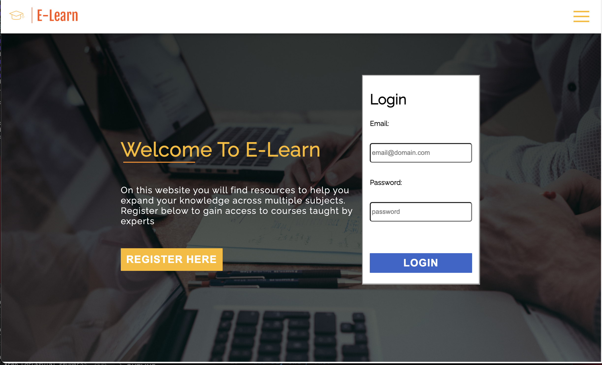
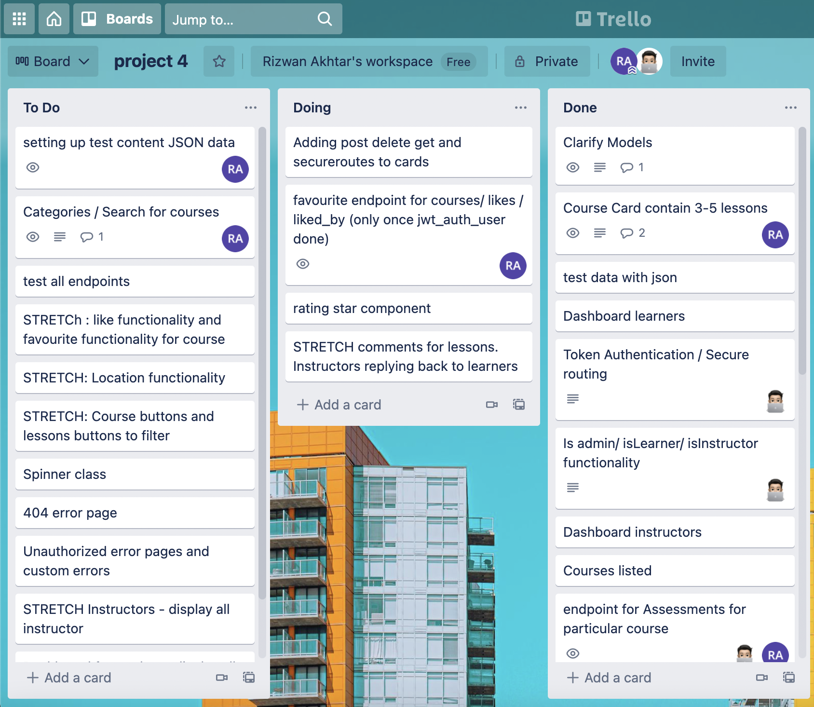

# Project 4: E-Learn - created using Django & React
## Timeframe : *7 Days*

## Overview
This was my final project at General Assembly, given 7 days to build a full-stack website using Django, PostgreSQL and React. As a pair, Abubakar and I decided to go for a E-Learn application aimed at anyone who wants to learn in subject areas Computing, English, Science and Maths. The website allows a user to register as an instructor or learner. The instructor can post courses, lessons, assessments whilst a learner can take tests and view lessons to indicate how strong they are in a lesson.




link to front-end [click here](https://github.com/rizwanakhtar7/project-4-client/tree/main)

### Brief
- Build a full-stack application by making your own backend and your own front-end.

- Use a Python Django API using Django REST Framework to serve your data from a Postgres database.

- Consume your API with a separate front-end built with React.

- Be a complete product which most likely means multiple relationships and CRUD functionality for at least a couple of models.

- Implement thoughtful user stories/wireframes that are significant enough to help you know which features are core MVP and which you can cut.

- Have a visually impressive design to kick your portfolio up a notch and have something to wow future clients & employers. ALLOW time for this.

- Be deployed online so it’s publicly accessible.


## Technologies Applied
- HTML5
- CSS3
- React
- Git
- GitHub
- Google Fonts
- Animate.css library
- Cloudinary
- PostgreSQL
- Django
- Python
- Heroku and Netlify
- Excalidraw

### Approach
- At the home page you can Login as an existing user or navigate to Register as an instructor or learner. 

- Once logged in you can navigate to the courses main page to view all courses, or filter by a given subject such as Maths. The user can then click on courses to view all the lessons in a course and then individual lessons details page which will contain a video of the lesson, quiz to test your knowledge and content of the lesson. You can also post a comment where an instructor can respond to  questions/ feedback you have.

### Day One/ Two:
* Pseudo-coding and Sign off with steps ERD Diagram and mockups:

 Drawing mockups of the different pages helped visualise the end application. Designs for how the dashboard would look like along with quiz, lessons, courses index & home page(see below):


 ERD diagrams were a requirement so we planned out all of our tables and the relationships between. This proved to be successful later when we wrote the code in Django and migrated the changes to the database using SQL. Addtionally, this helped me prepare for the complexity of our application as we had a solid 7 tables to work with, some with more then one relationship.


Once we got the sign off, we successfully had the weekend to jump into coding. Abubakr & I decided to use Trello to organise our responsibilities. Due to the complexity of our application, we both demonstrated flexibility in helping each other to jump on more urgent tasks and priotise goals.



At first, we worked together on setting up the project on GitHub and migrating the model changes to the database.

Later we split up to work on separate tasks throughout the remaining days.

### Day Three/ Four:
- Together completed & migrated the models to the database using Django.  

We split up to work on the following tasks:
- Abubakr - User roles, JWT authentication, authentication for learners and instructors to make sure learners cannot delete, post courses, lessons & assessments.

- I worked on the endpoints which would be consumed by the frontend. Additionally a 'rating' functionality which would give learners ability to give a rating for each course. The average would be shown on the course index page. In the backend I created a many to many relationship on the course table (see code below): 

```
 rating_by = models.ManyToManyField(
        'jwt_auth.User',
        related_name='ratings',
        blank=True
    )
    favorited_by = models.ManyToManyField(
        'jwt_auth.User',
        related_name='favorites',
        blank=True
    )
    owner = models.ForeignKey(
        'jwt_auth.User',
        related_name="courses_created",
        on_delete=models.CASCADE
    )

```

- I created the controllers to handle the logic for this and the Serializer to handle this to create JSON to be consumed later with axios requests in the frontend.


### Day Five:
We completed the controllers and all the endpoints and spent time testing these in the client.http. Also the rating review I spent testing to make sure an average would correctly show for each course.

### Day Six/ Seven:
Having completed the MVP of the backend I moved onto the frontend working on:
- Sidenavbar to create links to the different pages.
- Courses Index to display all courses with the lessons along with the rating.
- Filter functionality to filter the courses by subject areas.
- Then I finished off by having an array of random motivational quotes for the dashboard.

```
  const quotes = [
    [{ quotedBy: 'Albert Einstein', quote: '“Wisdom is not a product of schooling but of the lifelong attempt to acquire it.”' }],
    [{ quotedBy: 'Anthony J. D’Angelo', quote: '“Develop a passion for learning. If you do, you will never cease to grow.”' }],
    [{ quotedBy: 'Jim Lovell', quote: '“You don’t understand anything until you learn it more than one way.”' }]
  ]

  ```

Then a random quote function which gets called on page load:

```
  const randomQuote = quotes[Math.floor(Math.random() * quotes.length)]

```


### Wins
- The biggest win was definitely that I became comfortable with Django and how to migrate and create models, controllers and test endpoints. Our project was complicated in terms of the models  so we had to often go back to the backend at some point to make alterations to the models. I had alot of fun experiencing this and become fluent juggling between front-end and back-end.

- I also was really impressed with how we managed to implement certain functionalites such as the number of stars for a course and using an average to calculate this.

- Learning Django/Python in one week and implement it in a project along with React.

### Challenges
- Implementing models in Django with our concept in 1 week.

- Gathering content for our different subjects.

- Posting assessments with questions, answers with correct answer in the backend.

- Displaying IDE for a certain language in the computing course. 

### Bugs
- For the Dashboard - a non-logged in user can view this and shows a blank name plus a broken image(see below):


### New Features To Implement 
- Giving Instructors ability to post assessments.
- Styling for Assessments with model to make it more visually attractive.
- Sharing Results on social media.
- Implementing the Dashboard to allow the users to have motivational quotes and view all favourited courses, all courses currently started making it more personalised.
- Badges for Learners to show points for courses.
- Having the instructor with their rating accordingly.
- Implementing rating feature so a learner can post a rating for a course after watching, then the average is calculated on the courses index page.


